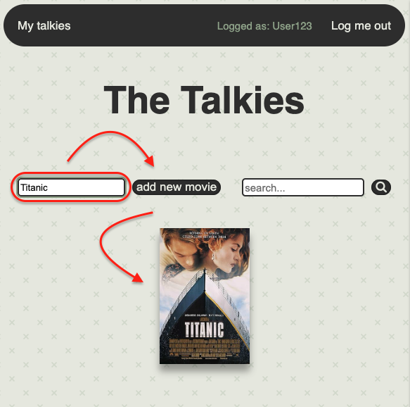
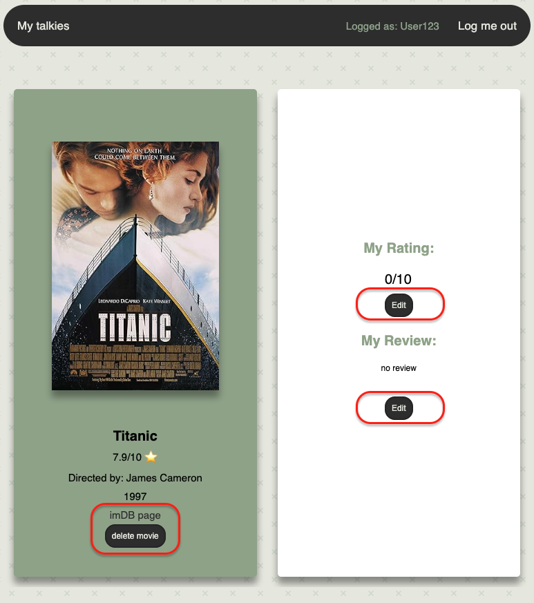

# ***Talkies*** 📽️

"Talkies" is a movie app where users can store their favorite movies, give rates and reviews. 
The names comes from the past where motion pictures with integrated sound were called "talkies". 

### Purpose 💡
The app is used as a library where the user can add their favorite motion pictures. The page fetches some of the information from an API, providing details like movie title, director, release year, imDB rating.

The user can interact with the app by adding or deleteing their movies. They can also add and amend thier own rating or reviews. 

### Setup 💻
"Talkies" is a web app and it requires a browser, internet connection and API KEY.
Create an .env file in which you will pass your API KEY for www.omdbapi.com in this format:

Start your setup by downloading this repository and installing all the dependencies.

The app comes with an empty sqlite database - make sure you can see it in the data directory.

Once everything is in place run the app on a server and start your own library. Just register a new user and log in! 

### Usage 🍿
As formentioned, you need to run the app on a server.
You will be asked to log in to see your library, or to first register if you do not have an account.

#### register:

#### login:

Once you are in, you will see a starting page with all you movies - of course if you are a new user the page will be empty. 

#### main page:

Add you first movie by typing a title and clicking the corresponding button (pssst once you have more movies in your collection, try to use a searchbar - it can help you find specific titles or directors).

#### add a new talkie:

You have your first movie, what now? You will notice that once yoi hover over the poster, it will increase in size - you can click it and you will be redirected to a movie page.

#### movie page:

Here you can see all the information about the talkie and manage it: delete the movie, go to the movie's imDB page or add/edit your rating and review.

#### movie page functionalities:

Once you are done enjoying the page, log yourself out.
See you next time! Your movies will be waiting for you.

## SQL schema
If you would like to set up your own database, here is the refernece table:

